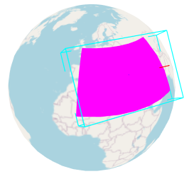

# makeOBBFromRegion

Creates an `OrientedBoundingBox` that encloses a longitude-latitude-height region on the WGS84
ellipsoid.



## Usage

```js
import {toRadians} from '@math.gl/core';
import {makeOBBFromRegion} from '@math.gl/geospatial';

const region = [
  toRadians(-10), // west
  toRadians(35), // south
  toRadians(20), // east
  toRadians(55), // north
  0, // minimum height
  1000 // maximum height
];

const boundingBox = makeOBBFromRegion(region);
```

## Functions

### makeOBBFromRegion(region : Number[6]) : OrientedBoundingBox

- `region` - An array containing `[west, south, east, north, minimumHeight, maximumHeight]`.
  Longitudes and latitudes are in radians. Heights are in meters relative to the WGS84 ellipsoid.
  A region can cross the antimeridian by specifying an `east` longitude smaller than `west`.

Returns a new `OrientedBoundingBox` that encloses the region. The orientation of the returned box
is an implementation detail and is not guaranteed to remain stable.
